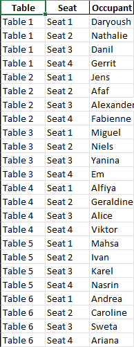

# challenge-openspace-classifier

## Description
The program is designed to randomly assign colleagues to seats in an open-space office layout. It reads a list of colleague names from a CSV titled 'new_colleagues', organizes them into tables with seats, and then saves the seating arrangement to an Excel file.

## Installation
To install and run the program:
- Clone this repository to your local machine.
- Ensure you have Python 3 installed.
- Navigate to the project directory.
- Run the program using `python main.py` from the terminal

## Usage
Navigate to the terminal and run the program using 'python main.py'. This will produce a new file titled 'assigned_seats.xlsx'. Each subsequent run will reshuffle the seat assignment and overwrite the existing 'assigned_seats.xlsx' file. 

## Visuals

## Contributors
This program was developed as part of the first project in the BeCode training within the Arai 6 group. Special thanks to our coach, Vanessa Rivera Quinones, and colleagues Miruna "Em" Suru, Gerrit Geeraerts, and Alice Mendes for their assistance and collaboration.

## Timeline
The project was assigned on the morning of February 8th with a deadline of 4pm on February 9th. It was completed within approximately 10 man-hours.

## Personal Situation
This project served as the introduction to Object-Oriented Programming (OOP) and practice to further hone my fundamental skills in looping, conditions, and functions. While challenging, it provided an opportunity to collaborate with colleagues and leverage available resources to produce functional code. I can see that each of us will have slightly different approaches to planning, executing, testing, and deploying. It's nice to find my own process and learn of alternative ways of doing it. 

